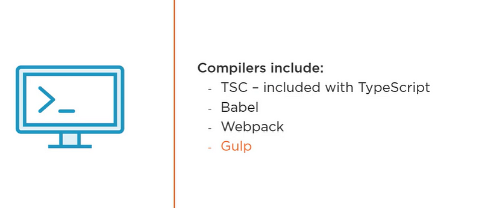
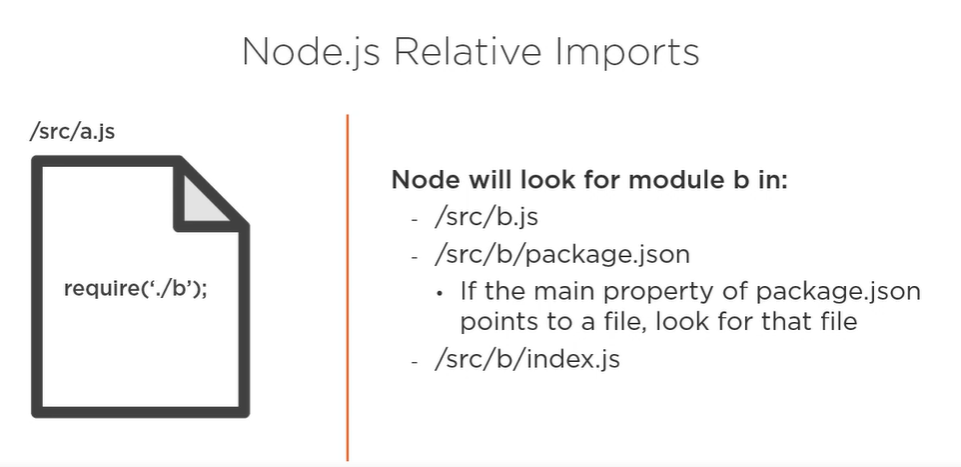
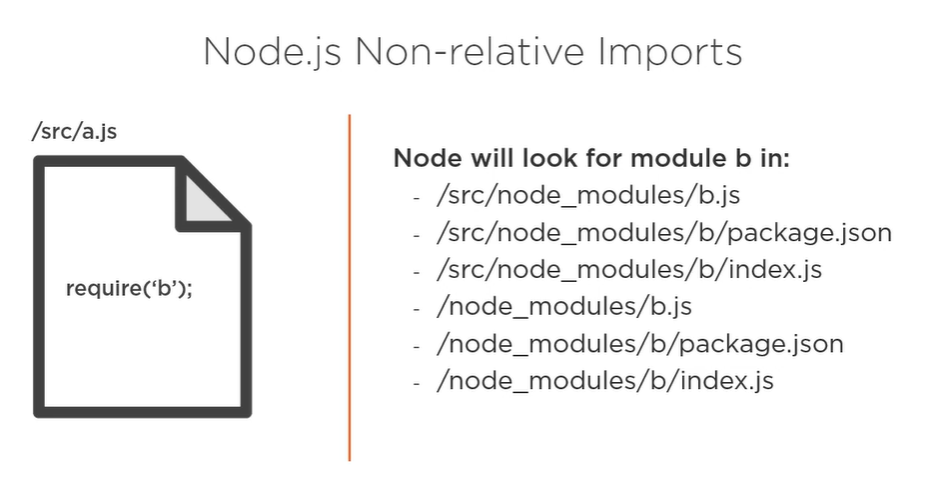
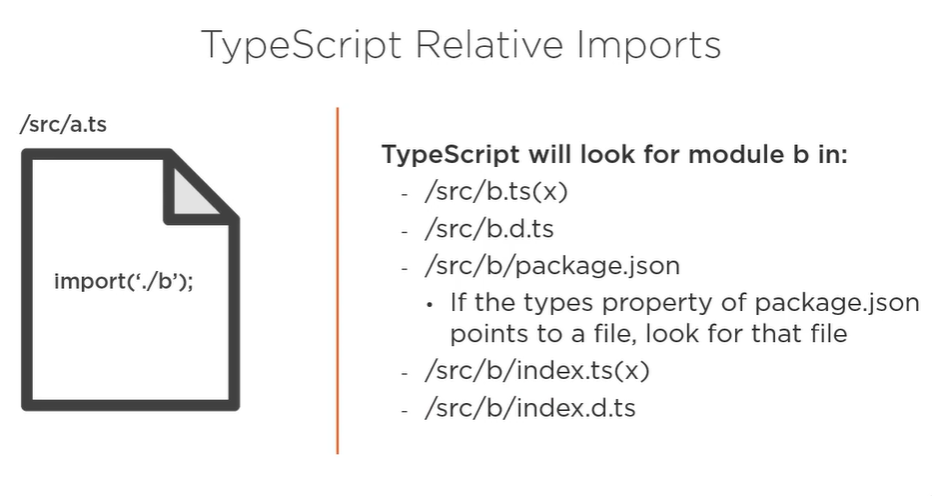
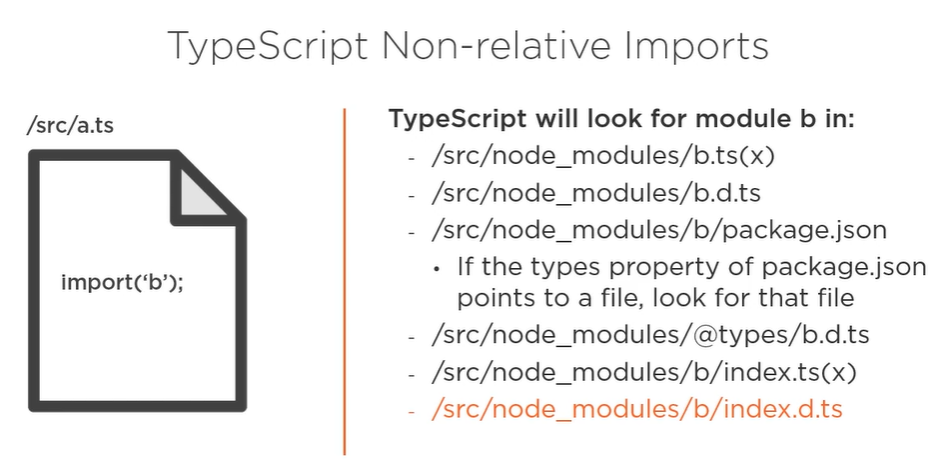
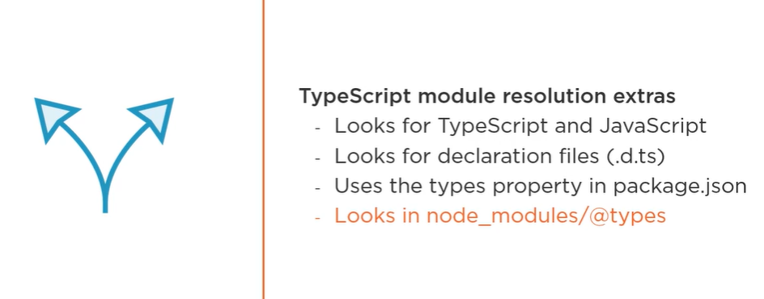

### Why use TS modules?
Front end applications are increasingly complex
Organisation and structure are critical
Reuse is the key

Modules are always evaluated in strict mode from version 5. For backward compatibility, we need to add 'use strict' in all files.
What makes a module a module ?
As opposed to just the TS or Js file, the presence of the import and/ export statements in the file, will make the file a module.
As opposed to regular scripts, modules are never evaluated in the global scope. The window object is available to all modules. You cannot access code defined in other modules unless the other module is exported and imported in your module.
Modules cannot be loaded locally in a html file. You will see CORS errors. You need to have a local web server to test modules during development.
Module execution is always deferred. The module is loaded asynchronously but not executed unless the ready event is fired i.e html parsing is completed.

### Project setup

1. C:\Users\User\angular>mkdir using-typescript-modules && cd using-typescript-modules

2. C:\Users\User\angular\using-typescript-modules>npm init

3. TS is only used in development, as it gets compiled to JS to be used with Node or browser.
So we install it as a dev dependency
C:\Users\User\angular\using-typescript-modules>npm install typescript --save-dev

4. Install TS globally to be used from anywhere
C:\Users\User\angular\using-typescript-modules>npm install typescript -g

5. Creating a tsconfig.json file using the below command which will control how the compilation from TS to JS occurs
C:\Users\User\angular\using-typescript-modules>tsc --init

6. In the tsconfig.json:

"target": "es2016"   
This is the JS version we will be targetting when the compiler converts TS into JS.

"module": "commonjs"
This property controls which module format the TS compiler will generate when it transpiles your TS into JS.
With commonjs you can run the compile Js files using node. Example: node b.js in the terminal.
Switch from commonjs to ES2015 to run the modules in the browser.

Change the outDir from "./" to "./dist" so that the compiled .js files are stored neatly in a seperate directory.

### To run the modules using node.

Ensure "module" in tsconfig.json is "commonjs".
Run tsc in the terminal.
Then execute node b.js in the terminal to see the output.

### To run the modules in the browser install a development web server

npm install esmodules-dev-server --save-dev

Ensure the "module" in tsconfig.json is changed from commonjs to ES2015
    "module": "ES2015",                                /* Specify what module code is generated. */

Run tsc in the terminal to regenerate the .js files.

Add index.html where you reference the b.js from dist.

Run npm run start

### JS module systems

AMD
CommonJS
UMD
ECMAScript(ES)

### Exporting from a module

A module will typically export values likes numbers,strings or functionality in terms of classes or functions.

The export keyword is prefixed to a declarations like var,let,const or function() or class.

Ways to export:

export const alpha="I am Alpha";

const beta="I am Beta";
export {beta};

const gamma="I am gamma";
export {gamma as coolGamma}; //give an alias

const sinTheta=" I am sinTheta";
const cosTheta=" I am cosTheta";

export {sinTheta,cosTheta}; //exporting multiple values at the same time.

export {lambda} from './c'; //reexporting a value exported from c.ts

### Importing into a module

You can import the values exported from other modules using the import keyword.

You can also provide an alias to the import.

import { alpha as greatAlpha, beta, coolGamma, cosTheta, lambda, sinTheta } from "./a";

If a module contains multiple exports, you can import it all a time using * into an object. Below
aExports is an object of all the exports from a.ts

import * as aExports from './a';

console.log(aExports.alpha);
console.log(aExports.beta);
console.log(aExports.coolGamma);
console.log(aExports.cosTheta);
console.log(aExports.sinTheta)
console.log(aExports.lambda)

### Barrel files

Barrel file exports everything exported from 1 more modules.
Example: In the barrel folder, index.ts is the barrel file which exports everything from the number.ts
and string.ts modules.

We can then just import required functionality from this index.ts in any other module.
We can then import findLength and numFunctions from the ./barrel/index. 

import { findLength,numFunctions} from "./barrel/index";

To provide more abstraction and
even hide the file i.e index.ts from which the functionality is exported, set moduleResolution to "node" in 
the tsconfig.json

"moduleResolution": "node",                     /* Specify how TypeScript looks up a file from a given module specifier. */

Now we can update the import statement to the below :

import { findLength,numFunctions} from "./barrel";

### Optionally loading modules

Below is wrong nesting of import statement within condition
if(condition){
    import  {something} from './somewhere';
}

Below is possible and correct with import expression only when module in tsconfig.json is ESnext or commonjs.
ESNext is a placeholder for future ECMaScript features. ES2015 does not support import expression: import().
ESNext supports import().

if(condition){
    import('./somewhere');
}

Conditionally loading c.ts and printing a value exported from the module.

if(Math.random() >= 0.5){
    import('./c').then(c=>console.log(c.lambda))
}

### importing JSON files

To import JSON files, set "resolveJsonModule": true in tsconfig.json

import * as config from './config.json';
console.log(config);

Will get below error when trying to log the json in the browser:

Failed to load module script: Expected a JavaScript module script but the server responded with a MIME type of "application/json". Strict MIME type checking is enforced for module scripts per HTML spec.

The reason is that only JS files can be modules in ES modules.Some 3rd party loaders like Babel or Webpack
can allow JSON files to be loaded as modules.

### Ambient Modules

Regular modules implement values and behaviors.
Ambient modules describe implementations. They are used to describe JS modules.
Ambient modules are referred to as declaration files as well. They have d.ts extension. They must
have the same file name as the file they describe.
Ambient modules are a special kind of TS file  that are used to describe the API  that a non-TS file
exposes.

### Manually creating declaration files for JS files

Created a file:cube.js and exported a function findCube().
To import this module in b.ts, we need to set the property "allowJs" to true in tsconfig.json.

    "allowJs": true,                                  /* Allow JavaScript files to be a part of your program. Use the 'checkJS' option to get errors from these files. */

I import the method in b.ts

import { findCube } from "./cube";

When I hover over the {findCube} I see the below:
(alias) function findCube(num: any): number

If you observe the argument has any type, which is not good. Even if I pass a string,the compiler
will not complain.

To resolve this, I create a file: cube.d.ts in the root of the project with the below content:

declare module 'cube'{
    export function findCube(num:number):number;
}

I mention the type of argument and also the return type of the function.

I get the below error message in the import in b.ts
File 'c:/Users/User/angular/using-typescript-modules/cube.d.ts' is not a module.ts(2306)

So i update the import to 

import { findCube } from "cube";

console.log(findCube(10))

This will throw the below error in the browser:
Uncaught TypeError: Failed to resolve module specifier "cube". Relative references must start with either "/", "./", or "../".

### Generating ambient modules or declaration files automatically for .ts files

You need to set "declaration" to true and "allowJS" to false in tsconfig.json.

When you run tsc, you will find d.ts file for every .ts file in the dist folder.

### Module Resolution

It is the process of locating and loading modules.

There are 2 strategies:
1. Node-default which mirrors NodeJS's module resolution strategy +additional behavior
2. Classic for backward compatibility

NodeJs uses require function to load modules.

const myModule=require('./somePath') // relative path begins with / or ./ or ../

const myModule=require('somePath') // absolute path

Node Js Relative Imports Strategy

If NodeJs doesnt find the module in any of the listed paths, it will throw an error

Node JS Absolute Imports Strtagy

Typescript Relative imports

Typescript Absolute Imports

Additional behavior points in TS over NodeJs module resolution strategy

### Module resolution tracing

It helps us determine the places Ts looked when trying to resolve a module.

We can enable tracing through command line option or updating tsconfig.json

Set "traceResolution" to true in tsconfig.json
OR
tsc --traceResolution

## Path configuration

The baseUrl option tells the compiler where to begin looking when resolving a module.

Path configuration using the paths option in the tsconfig.json allows us to map 1 path onto another path.
Path mapping can simplify imports or reach modules outside the baseUrl.
baseUrl must be configured to use path mapping and paths are always relative to the baseUrl.

Example for simplifying imports:

I have created a module special.ts within some/special/deep/paths folder.
To use this module in b.ts, I have to use this long import:
import { specialStr } from "./some/special/deep/paths/special";

I can use path alias to make it shorter.
The key of the paths property must be the name of the new mapped path relative to the baseUrl
The value is an array of the paths TS must search for that key.

"paths": {
      "deep/*":["/some/special/deep/paths/*"]
    },  
deep/* means deep/<any module name can come here>
Whenever I use deep/<any module name can come here> in the import path, TS will try to resolve the module
in "/some/special/deep/paths/*. Again * here means any module name.

Import is now updated to 
import { specialStr } from 'deep/special';

